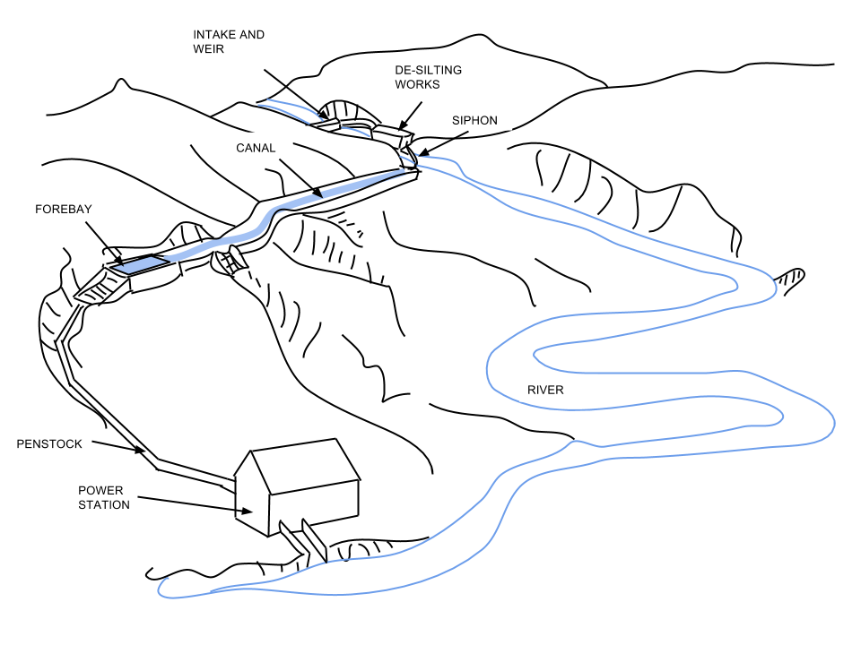

## Civil 'Design thinking' Engineer

"I view a civil engineer as a civil servant -- one with the capacity to drive major positive change in communities through infrastructure, innovation and technical expertise.
_The people-centric nature of Civil Engineering, has lead me to Design practices. This has been a recent focus in my career, which I would like to develop further going forward._"

[comment]: <> ([]({{ site.url }}/Khanya Bouma Cover letter.pdf))

<a href="{{ site.url }}/Khanya Bouma CV.pdf"> </a>
<a href="{{ site.url }}/Khanya Bouma Cover letter.pdf"> </a> 
<a href="{{ site.url }}/Khanya Bouma General Reference.pdf"> </a>
<a href="{{ site.url }}/Khanya Bouma Project Experience.pdf"> </a>


##Water and renewable engeries are my passion.

Involved in numerous studies and most notably my work as Team Lead of a 2.4 MW hydropower project in Rwanda.



<div>
<iframe src="https://drive.google.com/open?id=0B5odbOSnP4slMFlBT240MmxBbVU/preview" width="640" height="480"></iframe>
</div>

```html                                                                                                   
<video src="https://drive.google.com/open?id=0B5odbOSnP4slZEpCY3dqM0d6TWc" poster="Ntaruka Poster Image.png" width="320" height="200" controls preload></video>

<video src="https://drive.google.com/open?id=0B5odbOSnP4slZEpCY3dqM0d6TWc" width="320" height="200" controls preload></video>
```

Whenever you commit to this repository, GitHub Pages will run [Jekyll](https://jekyllrb.com/) to rebuild the pages in your site, from the content in your Markdown files.

### Markdown

Markdown is a lightweight and easy-to-use syntax for styling your writing. It includes conventions for

```markdown
Syntax highlighted code block

# Header 1
## Header 2
### Header 3

- Bulleted
- List

1. Numbered
2. List

**Bold** and _Italic_ and `Code` text

[Link](url) and 
```

For more details see [GitHub Flavored Markdown](https://guides.github.com/features/mastering-markdown/).

### Jekyll Themes

Your Pages site will use the layout and styles from the Jekyll theme you have selected in your [repository settings](https://github.com/KhanyaBouma/khanyabouma.github.io/settings). The name of this theme is saved in the Jekyll `_config.yml` configuration file.

### Support or Contact

Having trouble with Pages? Check out our [documentation](https://help.github.com/categories/github-pages-basics/) or [contact support](https://github.com/contact) and we’ll help you sort it out.
